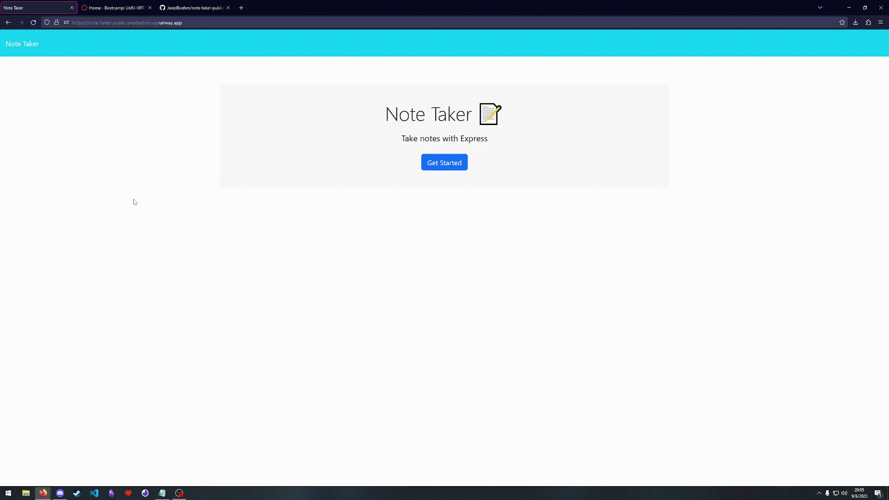

# note-taker

## Description
A simple note taking app that uses a json file to persist data, hosted on [railway.app](https://railway.app/)

## Installation
git clone to your local machine 

npm i && node index.js

## Usage

The end result can also be viewed live [here.](https://note-taker-public-production.up.railway.app/)

Sample of it's features:

## License
NA
